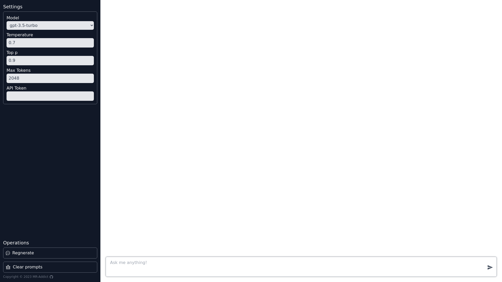

# Chat GPT Client 

## 1. Preview



## 2. Build and Deploy

Install packages:

```bash
npm install
```

Build project:

```bash
npm run build
```

Preview project:

```bash
npm run preview
```

> Tip:
> You can use any HTTP server to serve static **dist** folder.

## 3. Available Links

- [https://chatgpt.mraddict.vercel.app](https://chatgpt.mraddict.vercel.app)
- [https://mr-addict.github.io/chat-gpt-client](https://mr-addict.github.io/chat-gpt-client)
